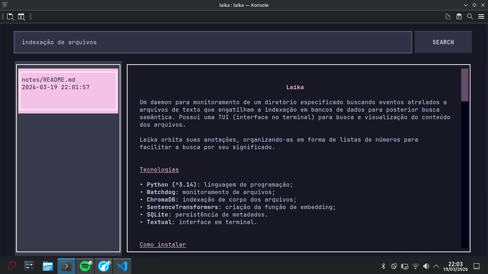

# Laika

Um daemon para monitoramento de um diretório especificado buscando eventos atrelados a arquivos de texto que engatilham a indexação em bancos de dados para posterior busca semântica. Possui uma TUI (interface no terminal) para busca e visualização do conteúdo dos arquivos.

Laika orbita suas anotações, organizando-as em forma de listas de números para facilitar a busca por seu significado.

## Tabela de conteúdos

1. [Tecnologias](#tecnologias)
2. [Como instalar](#como-instalar)
3. [Comportamentos da aplicação](#comportamentos-da-aplicação)
    - [Worker autônomo](#do-worker-autônomo)
    - [Esquema de metadados](#do-esquema)
    - [Criação de arquivos](#da-criação-de-arquivos)
    - [Modificação de arquivos](#da-modificação-de-arquivos)
    - [Movimentação de arquivos](#da-movimentação-de-arquivos)
    - [Deleção de arquivos](#da-deleção-de-arquivos)
4. [Interface](#interface-de-usuário-no-terminal)
5. [Motivação](#motivação)
6. [Créditos](#créditos)

## Tecnologias

- **Python (3.8 ou superior)**: linguagem de programação;
- **Watchdog**: monitoramento de arquivos;
- **ChromaDB**: indexação de corpo dos arquivos;
- **SentenceTransformers**: criação da função de embedding;
- **SQLite**: persistência de metadados.
- **Textual**: interface em terminal.

## Como instalar

Para a instalação do projeto, é necessário clonar o repositório com o git, usando o terminal para rodar os comandos a seguir:

```bash
git clone https://github.com/yuriteixeirac/laika

cd laika
```

Para a instalação das dependências, ative um ambiente virtual e instale com Poetry como no exemplo a seguir:

```bash
python3 -m venv .venv
source .venv/bin/activate

pip install poetry    # caso não o tenha instalado
poetry install
```

Para as variáveis de ambiente, o projeto conta com um exemplo para um arquivo `.env`, que requer um token para a API da HuggingFace, um modelo de embedding (recomenda-se usar um modelo leve e adequado a seu idioma de preferência), e a pasta que o daemon deve monitorar.

```
HF_TOKEN=   # opcional para melhor experiência
LAIKA_MONITORED_DIR=   # pasta que o watchdog vai usar
LAIKA_EMBEDDING_MODEL=    # modelo para embedding no banco de vetores
```

Com isso, o Laika está pronto para uso.

## Comportamento da aplicação

O daemon pode ser configurado como uma script que inicia com o sistema para funcionar integralmente.

Sua função é monitorar um diretório de forma recursiva, buscando por eventos como a criação, movimentação, modificação, deleção de um arquivo. Esses eventos disparam funções que buscam corroborar com a integridade dos dados sendo manipulados, de forma a se comportarem de maneira previamente estipulada, como descrito abaixo:

### Do esquema

O esquema montado no banco de dados SQLite consiste em uma única tabela que simula a entidade de um arquivo, criada a partir do comando:

```sql
CREATE TABLE IF NOT EXISTS files (
    id INTEGER PRIMARY KEY,
    path TEXT UNIQUE NOT NULL,
    hash TEXT,
    created_at TEXT DEFAULT (datetime('now', 'localtime')),
    last_updated TEXT DEFAULT (datetime('now', 'localtime'))
)
```

### Do worker autônomo

Para evitar processamento computacional excessivo, foi implementado um mecanismo de debounce: o arquivo só é realmente indexado no banco de vetores assim que se passa o tempo pré-definido de 15 segundos. Isso evita que o processo ocorra a cada modificação salva detectada no arquivo, poupando o constante processo de embedding e indexação.

Sua implementação depende de uma thread iniciada no arquivo principal do daemon, onde, a cada evento cujo uso do banco de vetores é necessário, o caminho do arquivo é incluído como chave em um dicionário (hash table), cujo valor é um temporizador (do tipo threading.Timer), que ao acabar o tempo, empurra o caminho a uma fila de consumo para ser indexada no banco de vetores.

### Da criação de arquivos

Na criação de um arquivo, o caminho é designado a uma variável e inserido no banco de metadados. Uma verificação é feita no intuito de checar se o arquivo criado apresenta conteúdo por meio do seu hash. Caso ele tenha conteúdo, seu caminho é encaminhado a um debouncer para indexação no banco de vetores.

### Da modificação de arquivos

Quando um arquivo é modificado, esse evento pode fazer referência ao nome do arquivo ou a seu conteúdo. Nesse caso, o caminho é passado como argumento para uma chamada no banco de dados onde, se a modificação foi o nome do arquivo, seu caminho é atualizado, caso seja o conteúdo, seu hash é computado e substituído usando seu caminho como referência. Em caso de hash não vazio, o caminho é referenciado em um debouncer.

### Da movimentação de arquivos

Ao movimentar um arquivo, a função verifica se sua nova localização é fora do diretório monitorado. Caso seja, seus metadados são deletados, seu conteúdo é desindexado e suas referências apagadas do debouncer.

### Da deleção de arquivos

Quando um arquivo é deletado, sua referência no debouncer é removida, seus metadados excluídos, assim como seu conteúdo indexado.

## Interface de usuário no terminal

O Laika usa uma interface no terminal para o contato com o que é produzido com o daemon.

A interface é constituída por uma barra de pesquisa, para inserção de queries textuais e um botão de envio, que performa a busca textual usando o conteúdo da barra de pesquisa.

A pesquisa engatilha uma atualização no componente a esquerda da tela (uma ListView), contendo cards referentes aos arquivos encontrados.

Cada card, ao detectar o evento de clique, passa o próprio conteúdo do arquivo para o componente a sua direita, um visualizador de Markdown.



## Motivação

Em razão do crescimento do meu hábito de anotação, percebi que precisava definir uma forma de organização para expandir esse hábito para outros tópicos de estudo, então pensei na possibilidade de guardar o conteúdo em um banco de vetores.

A ideia posta em prática serve bem, substituindo ferramentas tradicionais de busca por conteúdo, como o grep, integrando uma interface para uso.

## Créditos

Desenvolvido por Yuri Teixeira.